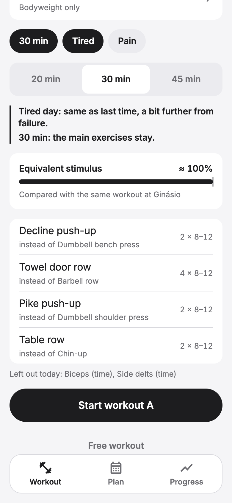

<div align="center">


# Progrex

**A training plan that adapts to you.**
Wherever you are, whatever today looks like, you keep progressing.

<sub>iOS · Android · Web, built with Expo, React Native and TypeScript</sub>

</div>

---

## A passion project

Progrex sits right where my two passions meet: **fitness** and **programming**.

Most fitness apps are logbooks: they record what you did and leave the thinking to you. But real life gets in the way. You change gyms, you travel, you end up training at home, you only have 20 minutes, you slept badly, your shoulder hurts, you miss a week. A fixed plan breaks, and so do your progress charts.

Progrex is built around the opposite idea. **The plan is the product. Logging is just a consequence.** You open the app, tap Start, and it has already adapted your mesocycle to your current conditions, so that, in theory, you keep making progress no matter what.

It's also my playground to design a real product end to end, training science on one side and software architecture on the other, and to keep learning both along the way.

## How it adapts to you

<table>
  <tr>
    <td align="center"><br /><sub><b>Today, adapted</b></sub></td>
    <td align="center"><br /><sub><b>Any place, any equipment</b></sub></td>
    <td align="center"><br /><sub><b>Targets that progress</b></sub></td>
  </tr>
  <tr>
    <td align="center"><br /><sub><b>What it meant</b></sub></td>
    <td align="center"><br /><sub><b>Progress that doesn't break</b></sub></td>
    <td align="center"><br /><sub><b>Your priorities</b></sub></td>
  </tr>
</table>

**Convenience first.** Three taps from install to your first workout (where, goal, days). On a normal day you don't fill anything in. The app infers what it can and only asks, with a single optional tap, for what it can't know.

| Your conditions | What the plan does | You have to… |
|---|---|---|
| A different place or no equipment | Picks the right variant for what's there (gym bench, home dumbbells, hotel push-ups) and keeps the stimulus | pick the place once |
| A trip | Travel mode until a date, then back to normal by itself | tap "3 days" |
| Only 20 minutes | Keeps the main movements, drops the rest in a smart order | one tap |
| Tired, slept badly | Same work as last time, a bit further from failure, no progression today | one tap |
| Pain in an area | Leaves out what loads it, keeps training the rest | one tap |
| A bad set mid-workout | The next sets adjust to what you actually did | nothing |
| A week or two off | Picks up where you left off; after a long break, an easier re-entry | nothing |
| A busy week | Merges the sessions left so you never fall behind | nothing |
| Stalled on an exercise | Changes the stimulus (another variant) instead of insisting | nothing |
| Stalled across the board | Recovers early instead of waiting for the planned deload | nothing |

**Under the hood**

- **Plans written in movements, not machines.** A mesocycle says *"horizontal push, 3 × 8–12"*; the exercise is chosen on the day. 4–5 week blocks with rising effort and a deload, for 2–6 days a week, fitted to your time and to the body areas you want to improve.
- **A progression engine that always has a next step.** Double progression with reps in reserve. When you can't add weight, it moves to the next lever: more reps, less rest, a slower tempo, an extra set, or a harder variant.
- **The Progrex Index.** Progress measured by movement, not by machine: bench press at the gym and push-ups at the hotel feed the same "push" line, without false drops when you switch places and without counting the same progress twice.
- **Effort in plain words.** *"How was it? Easy / Good / Hard / All out"*; it's still reps in reserve under the hood.
- **Local-first.** Works offline, in the gym, with no account.

## Tech stack

| Layer | Choice |
|---|---|
| Language | TypeScript 6 (strict) across the app and the shared training logic |
| App | Expo SDK 57, React Native 0.86, Expo Router |
| Local data | SQLite (`expo-sqlite`, async API) + Drizzle ORM, custom migrator and live queries |
| Domain logic | Pure TypeScript in `packages/shared`: adaptation, progression engine, plan generator, metrics |
| Validation | Zod schemas shared across the app |
| UI | Custom design system (tokens, Inter, monochrome), Reanimated, `react-native-svg` charts |
| i18n | English and European Portuguese (i18next) |
| Tests | Vitest: 86 tests, including 960 generated plans checked against domain rules |
| Tooling | npm workspaces (monorepo), ESLint, Prettier |
| Planned | Cloudflare Workers + D1 for sync between devices |

## Project structure

```
apps/mobile/          Expo app (iOS, Android, web)
  src/app/            Screens (file-based routes)
  src/features/       Workouts, plans, progress, places, exercises…
  src/db/             Schema, migrations, live queries
  src/ui/             Design system and charts
packages/shared/      Training logic with no UI or database
  src/progression/    Progression engine and variant selection
  src/plan/           Mesocycle templates, generator and validation
  src/adapt/          Adapting today's session to your conditions
  src/metrics/        Progrex Index, hard sets, stimulus
docs/                 Design decisions and concepts
```

## Getting started

Requires Node.js 20.19+, 22.13+ or 24.3+.

```bash
npm install
npm run dev        # start Expo, then scan the QR code with Expo Go
npm run web        # open in the browser
npm run preview    # production web build at http://localhost:8100
npm test           # run the test suite
npm run typecheck  # type-check every package
```

## Roadmap

- [x] Workout logging with one-tap sets and automatic rest timing
- [x] Progression engine and variant selection by equipment
- [x] Mesocycles, travel mode and the body map
- [x] Adapting to your day: time, energy, pain, breaks, busy weeks, stagnation
- [x] Progress screen with the Progrex Index
- [ ] Sync between phone and web
- [ ] App Store / Play Store builds
- [ ] AI features: plan suggestions and progress photos (kept on device)

## License

© Angelo Sobral. All rights reserved. The source is public to read and learn from; please ask before reusing it.
