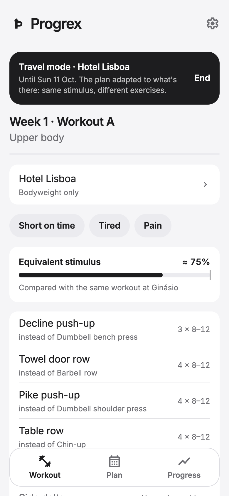
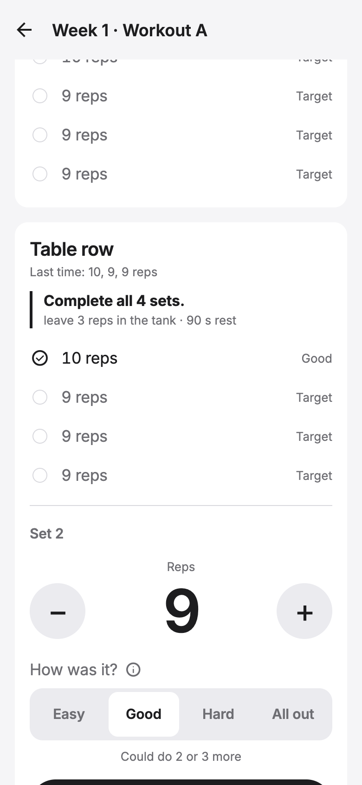
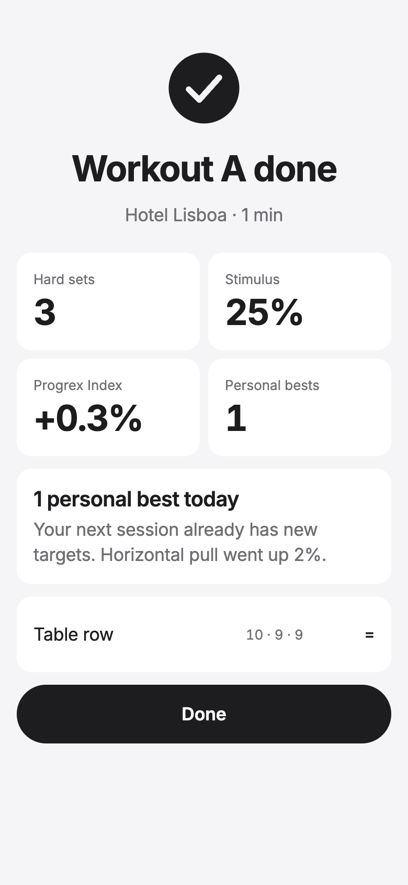
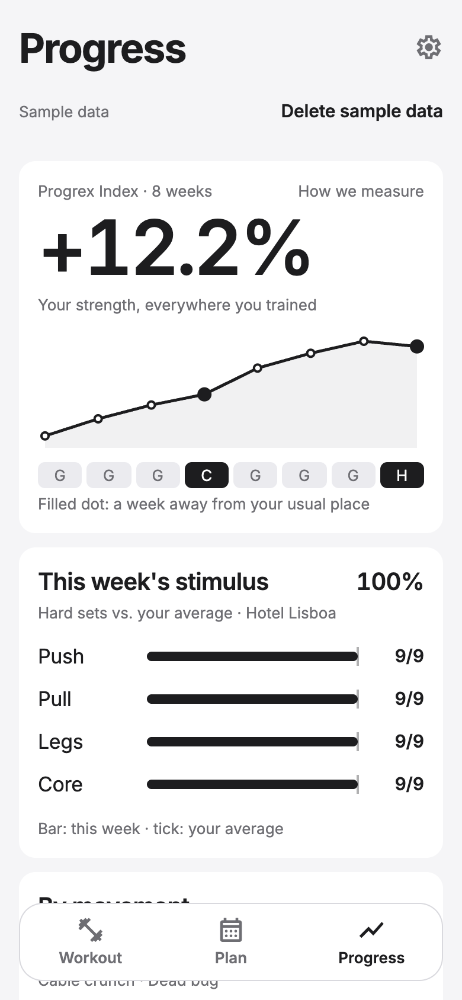
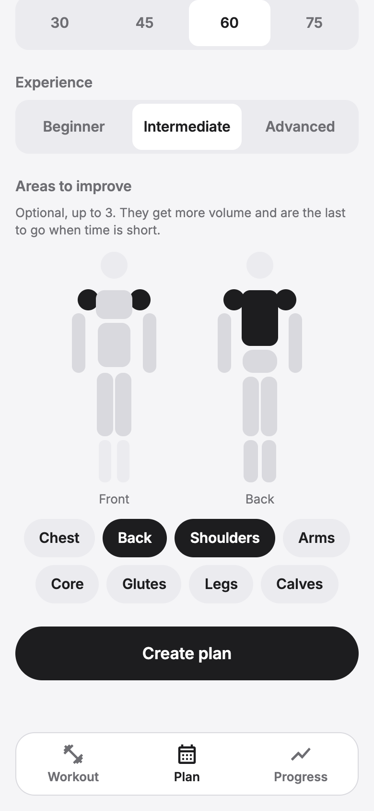

<div align="center">


# Progrex

**Training that adapts to wherever you are.**
Progress measured by movement, not by machine.

<sub>iOS · Android · Web — built with Expo, React Native and TypeScript</sub>

</div>

---

## A passion project

Progrex sits right where my two passions meet: **fitness** and **programming**.

Anyone who trains knows the problem: the moment you change gyms, travel, or end up training at home for a few days, your plan stops making sense and your progress charts flatline. Most apps track progress *per exercise*, so a week of push-ups in a hotel room counts for nothing towards your bench press.

So I'm building the app I want to use. Progrex is my playground to design a real product end to end, training science on one side, software architecture on the other, and to keep learning both along the way.

## What makes it different

<table>
  <tr>
    <td align="center"><br /><sub><b>Travel mode</b></sub></td>
    <td align="center"><br /><sub><b>One-tap logging</b></sub></td>
    <td align="center"><br /><sub><b>Workout summary</b></sub></td>
    <td align="center"><br /><sub><b>Progress</b></sub></td>
    <td align="center"><br /><sub><b>Body map</b></sub></td>
  </tr>
</table>

- **Plans built from movements, not machines.** A plan says *"horizontal push, 3 × 8–12"*. On the day, Progrex picks the right exercise for the equipment you have — barbell bench at the gym, dumbbells at home, decline push-ups in a hotel room with nothing at all.
- **A progression engine that always has a next step.** Double progression with reps in reserve. When you can't add weight (those 20 kg home dumbbells…), it moves to the next lever: more reps, less rest, a slower tempo, an extra set, or a harder variant.
- **The Progrex Index — progress that doesn't break.** Every exercise is compared only with itself, and movements combine them over time. Bench press at the gym and push-ups at the hotel feed the same "push" line, without false drops when you switch places and without counting the same progress twice.
- **Equivalent stimulus & travel mode.** Tell the app you're away until Sunday; it adapts the plan ahead of time, shows what changed (*"Decline push-up — instead of dumbbell bench press"*) and how much of your usual training you keep.
- **Effort in plain words.** Beginners answer *"How was it? Easy / Good / Hard / All out"*; under the hood it's still RIR, so the engine stays precise.
- **Body map.** Pick up to three areas to improve; they get extra volume and are the last thing cut when time is short.
- **Mesocycles from templates.** 4–5 week blocks with rising effort and a deload, for 2–6 days a week, fitted to the minutes you have.
- **Local-first.** Everything works offline, in the gym, with no account.

## Tech stack

| Layer | Choice |
|---|---|
| Language | TypeScript 6 (strict) across the app and the shared training logic |
| App | Expo SDK 57, React Native 0.86, Expo Router |
| Local data | SQLite (`expo-sqlite`, async API) + Drizzle ORM, custom migrator and live queries |
| Domain logic | Pure TypeScript in `packages/shared` — progression engine, plan generator, metrics |
| Validation | Zod schemas shared across the app |
| UI | Custom design system (tokens, Inter, monochrome), Reanimated, `react-native-svg` charts |
| i18n | English and European Portuguese (i18next) |
| Tests | Vitest — 71 tests, including 960 generated plans checked against domain rules |
| Tooling | npm workspaces (monorepo), ESLint, Prettier |
| Planned | Cloudflare Workers + D1 for sync between devices |

## Project structure

```
apps/mobile/          Expo app (iOS, Android, web)
  src/app/            Screens (file-based routes)
  src/features/       Workouts, plans, progress, places, exercises…
  src/db/             Schema, migrations, live queries
  src/ui/             Design system and charts
packages/shared/      Training logic with no UI or database
  src/progression/    Progression engine and variant selection
  src/plan/           Mesocycle templates, generator and validation
  src/metrics/        Progrex Index, hard sets, stimulus
docs/                 Design decisions and concepts
```

## Getting started

Requires Node.js 20.19+, 22.13+ or 24.3+.

```bash
npm install
npm run dev        # start Expo — scan the QR code with Expo Go
npm run web        # open in the browser
npm run preview    # production web build at http://localhost:8100
npm test           # run the test suite
npm run typecheck  # type-check every package
```

## Roadmap

- [x] Workout logging with one-tap sets and automatic rest timing
- [x] Progression engine and variant selection by equipment
- [x] Mesocycles, travel mode and the body map
- [x] Progress screen with the Progrex Index
- [ ] Sync between phone and web
- [ ] App Store / Play Store builds
- [ ] AI features: plan suggestions and progress photos (kept on device)

## License

© Angelo Sobral. All rights reserved. The source is public to read and learn from; please ask before reusing it.
